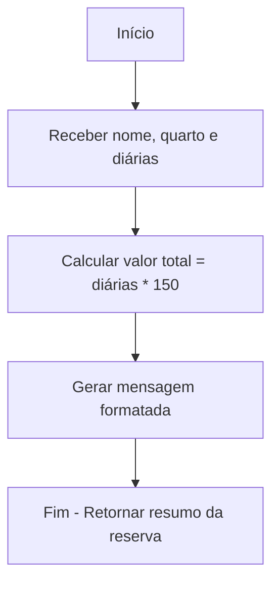

# 🏨 Manipulando Valores e Trabalhando com Exceções em C\#

## Implementando um Sistema de Mensagens para Reservas

### 📌 Desafio

Você foi contratado para integrar uma nova funcionalidade ao **sistema interno de reservas** de um cliente. Esse sistema precisa registrar informações básicas sobre hospedagens e retornar um **resumo simples da reserva feita**.

O objetivo é implementar uma função que será utilizada por outros módulos do sistema para registrar uma nova hospedagem.


### 📝 Entrada

O programa solicita as seguintes informações:

1. **Nome do hóspede** (String)
2. **Número do quarto** (int)
3. **Quantidade de diárias contratadas** (int)


### 📤 Saída

O programa deverá retornar uma mensagem no seguinte formato:

```
<nome> vai se hospedar no quarto <quarto> por R$<valor_total>
```

O valor total é calculado multiplicando o número de diárias por **R\$150**.


### 📊 Exemplos de execução

| Entrada          | Saída                                           |
| ---------------- | ----------------------------------------------- |
| Aline / 101 / 3  | Aline vai se hospedar no quarto 101 por R\$450  |
| Marina / 102 / 1 | Marina vai se hospedar no quarto 102 por R\$150 |
| Carlos / 203 / 2 | Carlos vai se hospedar no quarto 203 por R\$300 |


### ⚙️ Estrutura do Projeto

O código foi desenvolvido em **C#** utilizando os princípios de **organização modular** e boas práticas de manipulação de valores.

* **Classe**: responsável por centralizar a lógica da reserva.
* **Método Estático**: registra a hospedagem e retorna a mensagem padronizada.
* **Tratamento de Exceções**: garante que entradas inválidas não quebrem o programa.


### 🖼️ Diagrama do Projeto



### ▶️ Como Executar

1. Clone o repositório:

   ```bash
   git clone https://github.com/seu-usuario/sistema-reservas.git
   ```
2. Acesse a pasta do projeto:

   ```bash
   cd sistema-reservas
   ```
3. Compile e execute o programa em C#:

   ```bash
   dotnet run
   ```

### 🚀 Tecnologias Utilizadas

* Linguagem: **C#**
* Paradigma: **Programação Orientada a Objetos (POO)**
* Framework: **.NET**

### 📚 Habilidades e Aprendizados Desenvolvidos

Durante o desenvolvimento deste projeto, foram exercitadas as seguintes competências:

* Manipulação de **valores numéricos e strings** em C#.
* Criação de **funções reutilizáveis** para registrar reservas.
* Implementação de **tratamento de exceções** (`try/catch`) para lidar com entradas inválidas.
* Boas práticas na separação entre **entrada, cálculo e saída**.
* Uso de **interpolação de strings** para formatar mensagens.
* Consolidação da experiência em desenvolvimento de aplicações **.NET Console**.

### 📌 Principais Competências

✔️ Manipulação de **valores e cálculos** em C#
✔️ Uso de **interpolação de strings** para mensagens dinâmicas
✔️ Implementação de **tratamento de exceções**
✔️ Organização da lógica em métodos reutilizáveis
✔️ Execução de programas no ambiente **.NET CLI**


### 🔧 Pontos de Melhoria

Apesar de funcional, o projeto pode evoluir em alguns aspectos:

* Permitir reservas com valores de diária diferentes por quarto.
* Incluir datas de check-in e check-out no cálculo.
* Criar um histórico de reservas registradas.
* Integrar com um banco de dados para armazenamento.
* Desenvolver uma interface gráfica ou API para uso externo.

---

👉 Deseja que eu faça também uma **versão em inglês deste README**, para padronizar com boas práticas de repositórios internacionais?
